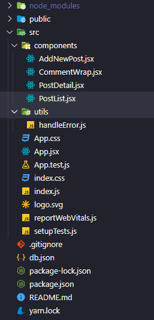

## Table of Content

- [JSON Server](#1-json-server)
- [Fetch from Server](#2-fetch-from-server)

#

## 1. [JSON Server](https://github.com/typicode/json-server)

- Là một thư viện giúp ta có thể tạo 1 máy chủ giả cung cấp RESTful API một cách đầy đủ trong 1 khoảng thời gian ngắn mà không cần code.

Cài JSON Server:

```bash
npm install --dev-save json-server
```

hoặc nếu dùng `yarn`:

```bash
yarn add json-server -D json-server
```

Thêm một đoạn script cho JSON Server trong khối `scripts` trong file `package.json`:

```json
"scripts": {
  ...,
  "start-server": "json-server --watch db.json --port 3001",
  ...
}
```

Tạo một file database (Ví dụ: `db.json`) cùng cấp folder với file `package.json` với 1 vài dữ liệu:

```json
{
  "posts": [
    {
      "id": 1,
      "title": "The first post",
      "body": "This is the first post",
      "author": { "username": "user1", "fullname": "User 1" }
    }
  ],
  "comments": [{ "body": "comment 1", "postId": "1", "id": 1 }],
  "authors": [
    { "id": 1, "username": "user1", "address": "Vietnam", "fullname": "User 1" }
  ]
}
```

Bắt đầu chạy JSON Server

```bash
npm run start-server
```

or

```bash
yarn start-server
```

Khi đã chạy server xong, nếu bạn call đến api [http://localhost:3001/posts/1]('http://localhost:3001/posts/1'), bạn sẽ nhận được:

```json
{
  "id": 1,
  "title": "The first post",
  "body": "This is the first post",
  "author": { "username": "user1", "fullname": "User 1" }
}
```

<!-- Tương tự, bạn có thể tạo requests với các phương thức khác, nhưng có vài lưu ý là:

- Nếu bạn tạo POST, PUT, PATCH hoặc DELETE requests, những thay đổi sẽ được lưu một cách tự động và an toàn vào file db.json (nhờ việc sử dụng [lowdb](https://github.com/typicode/lowdb))
- Phần body truyền lên của request phải là một đối tượng JSON, giống như kết quả cuả phương thức GET (ví dụ: `{"name": "The first post"}`)
- Trường `id` là không thể thay đổi. Nếu có bất kì trường `id` nào trong phần body của PUT hoặc PATCH request sẽ được bỏ qua. Nếu là trong POST request thì sẽ được chấp nhận, nhưng chỉ khi giá trị `id` đó chưa được sử dụng.
- Một POST, PUT, PATCH request phải `Content-Type: application/json` trong phần header để sử dụng JSON strong phần body của request. Nếu không thì vẫn sẽ trả về status code 2XX, nhưng phần data sẽ không được thay đổi. -->

## 2. Fetch from Server

- Sử dụng bộ API có sẵn của [JSONPlaceholder](https://jsonplaceholder.typicode.com/)
- Ta sử dụng method fetch() của Javascript

```javascript
fetch(resource, options);
```

Trong đó:

- resource: Tham số này chỉ định đường dẫn của tài nguyên mà bạn muốn truy xuất (có thể là tương đối hoặc tuyệt đối).
- options: Là một object chứa bất kì cài đặt tùy chỉnh request mà bạn muốn. Những options có thể là:
  - method: Chỉ định method cho request. Ví dụ: GET, POST, PUT,...
  - headers: Một object chứa bất kỳ tiêu đề nào bạn muốn đưa vào yêu cầu.
  - body: Là phần payload (hay data) được gửi kèm request, thường được dùng kèm với các methods như POST, PUT hoặc PATCH.
  - Khác: Ngoài ra còn nhiều options khác ví dụ như: mode, credentials, cache, redirect

Kết quả trả về của methods fetch() là một [Promise](https://developer.mozilla.org/en-US/docs/Web/JavaScript/Reference/Global_Objects/Promise)

Để xử lý bất đồng bộ khi call api, chúng ta thể dùng callback, hoặc Promise, hoặc async await (từ ES6).

Ví dụ sử dụng Promise ở trang home ('/'), hoặc trang tạo mới bài viết ('/post/add-new'). Ví dỵ sử dụng async/await ở trang chi tiết bài viết (/posts/:id)

### Ví dụ

Chúng ta sẽ tạo một ví dụ để minh họa cách sử dụng fetch và sử dụng luôn server tạo từ json-server trước đó. Chúng ta sẽ gồm 3 page: Danh sách bài viết (PostList), Thêm mới bài viết (AddNewPost) và Chi tiết bài viết (PostDetail). Chúng ta sẽ dùng thêm thư viện `react-router-dom` để chuyển giữa các page

Cấu trúc thư mục:



Trước hết, tạo một file `PostList.jsx`

```javascript
import React from "react";
import { Link } from "react-router-dom";
import { useNavigate } from "react-router-dom";
import handleError from "../utils/handleError";
const url = "http://localhost:3001/posts";

const PostList = () => {
  const [posts, setPosts] = React.useState([]);
  const [error, setError] = React.useState("");

  const navigate = useNavigate();

  const handleDelete = (selectedItem) => {
    fetch(`${url}/${selectedItem.id}`, {
      method: "DELETE",
    })
      .then((data) => {
        // Fetch trả về lỗi nếu status code >= 400 (4xx or 5xx)
        if (data.status >= 400) {
          throw new Error(data.message || "Bad response from server");
        }
        return data.json();
      })
      .then((data) => {
        setPosts(posts.filter((item) => item.id !== selectedItem.id));
      })
      .catch((error) => {
        handleError(error.message, setError); // handle error
      });
  };

  const handleAddClick = () => {
    navigate("/posts/add-new");
  };

  React.useEffect(() => {
    // Ở đây, ta có thể xử lý bất đồng bộ bằng cách dùng Promise hoặc async/await
    // 1. sử dụng Promise
    const getPostsListPromise = () => {
      fetch(url)
        .then((data) => {
          if (data.status >= 400) {
            throw new Error(data.message || "Bad response from server");
          }
          return data.json();
        })
        .then((data) => {
          setPosts(data);
        })
        .catch((error) => {
          setPosts([]);
          handleError(error.message, setError);
        });
    };

    // 2. sử dụng async await
    const getPostsListAsyncAwait = async () => {
      try {
        const response = await fetch(url);
        const jsonData = await response.json();
        setPosts(jsonData);
      } catch (error) {
        setPosts([]);
        handleError(error.message, setError);
      }
    };

    getPostsListPromise();
  }, []);

  return (
    <div className="container">
      <div className="d-flex align-items-center justify-content-between">
        <h3 className="  my-4">Danh sách bài viết</h3>
        <button className="btn btn-primary" onClick={handleAddClick}>
          Tạo mới
        </button>
      </div>
      {error && <p className="text-danger">Lỗi: {error}</p>}
      <table className="table">
        <thead>
          <tr>
            <th scope="col" style={{ textAlign: "center" }}>
              ID
            </th>
            <th scope="col">Tiêu đề</th>
            <th scope="col">Nội dung</th>
            <th
              scope="col"
              style={{ textAlign: "center", whiteSpace: "nowrap" }}
            >
              Hành động
            </th>
          </tr>
        </thead>
        <tbody>
          {posts.map((item) => (
            <tr key={item.id}>
              <th scope="row" style={{ textAlign: "center" }}>
                {item.id}
              </th>
              <td>
                {/* <a href={`/posts/${item.id}`}>{item.title}</a> */}
                <Link to={`/posts/${item.id}`}>{item.title}</Link>
              </td>
              <td> {item.body} </td>
              <td style={{ textAlign: "center" }}>
                <button
                  className="btn btn-primary"
                  onClick={() => handleDelete(item)}
                >
                  Xóa
                </button>
              </td>
            </tr>
          ))}
        </tbody>
      </table>
    </div>
  );
};

export default PostList;
```

Thêm thêm PostDetail.jsx

```javascript
import React, { useEffect, useState } from "react";
import { useNavigate, useParams } from "react-router-dom";
import handleError from "../utils/handleError";
import CommentWrap from "./CommentWrap";
// url để fetch đến post resource
const urlPost = "http://localhost:3001/posts";
// url để fetch đến comment resource
const urlComment = "http://localhost:3001/comments";

const PostDetail = () => {
  const navigate = useNavigate();
  const [post, setPost] = useState({});
  const [comments, setComments] = useState([]);
  const [error, setError] = useState("");
  const { id } = useParams();

  const handleBackClick = () => {
    navigate(-1);
  };

  useEffect(() => {
    const getData = async () => {
      try {
        // Promise.all để giảm tốc độ call api
        const response = await Promise.all([
          fetch(`${urlPost}/${id}`),
          fetch(`${urlPost}/${id}/comments`),
        ]);
        const [detailPost, commentList] = response;

        setPost(await detailPost.json());
        setComments(await commentList.json());
      } catch (error) {
        handleError(error.message, setError);
      }
    };

    getData();
  }, [id]);

  const handleDeleteComment = async (commentId) => {
    try {
      await fetch(`${urlComment}/${commentId}`, {
        method: "DELETE",
      });
      setComments(comments.filter((item) => item.id !== commentId));
    } catch (error) {
      handleError(error.message, setError);
    }
  };

  const handleAddComment = async (newComment, callback) => {
    try {
      const response = await fetch(`${urlComment}`, {
        method: "POST",
        headers: {
          "Content-Type": "application/json",
        },
        body: JSON.stringify({
          body: newComment,
          postId: post.id,
        }),
      });

      const jsonData = await response.json();
      callback();
      setComments([...comments, jsonData]);
    } catch (error) {
      handleError(error.message, setError);
    }
  };

  return (
    <div className="container">
      <div className="d-flex align-items-center justify-content-between">
        <h3 className="my-4">Chi tiết bài viết</h3>
        <button className="btn btn-outline-secondary" onClick={handleBackClick}>
          Quay lại
        </button>
      </div>
      {error && <p className="text-danger">Lỗi: {error}</p>}
      <div className="content-wrap">
        <div className="">Tiêu đề: {post.title}</div>
        <div className="">Nội dung: {post.body}</div>
        <CommentWrap
          comments={comments}
          handleDelete={handleDeleteComment}
          handleAdd={handleAddComment}
        />
      </div>
    </div>
  );
};

export default PostDetail;
```

Trong page PostDetail sẽ bao gồm cả comment, tuy nhiên, chúng ta sẽ tách code của phần comment ra riêng để clean code hơn.

Chúng ta cũng có thể thêm file `AddNewPost.jsx` để xử lý thêm bài post

```javascript
import React, { useState } from "react";
import { useNavigate } from "react-router-dom";
import handleError from "../utils/handleError";

const url = "http://localhost:3001/posts";

const AddNewPost = () => {
  const [title, setTitle] = useState("");
  const [body, setBody] = useState("");
  const [error, setError] = useState("");

  const navigate = useNavigate();

  const handleSaveClick = async (event) => {
    event.preventDefault(); // chặn hành động mặc định của form (hành động submit form)
    if (title.trim() && body.trim()) {
      fetch(url, {
        method: "POST",
        headers: {
          "Content-Type": "application/json",
        },
        body: JSON.stringify({
          title,
          body,
        }),
      })
        .then((data) => {
          if (data.status >= 400) {
            throw new Error(data.message || "Bad response from server");
          }
          return data.json();
        })
        .then((data) => {
          navigate(-1);
        })
        .catch((error) => {
          handleError(error.message, setError);
        });
    } else {
      handleError("Vui lòng điền đẩy đủ thông tin", setError);
    }
  };

  const handleBackClick = (event) => {
    event.preventDefault(); // chặn hành động mặc định của form (hành động submit form)
    navigate(-1);
  };

  return (
    <div className="container">
      <div className="d-flex align-items-center justify-content-between">
        <h3 className="my-4">Tạo mới bài viết</h3>
      </div>

      {error && <p className="text-danger">Lỗi: {error}</p>}
      <form>
        <div className="form-group">
          <label htmlFor="titleInput">Tiêu đề:</label>
          <input
            value={title}
            onChange={(event) => {
              setTitle(event.target.value);
            }}
            type="text"
            className="form-control"
            id="titleInput"
          />
        </div>
        <div className="form-group">
          <label htmlFor="bodyInput">Nội dung:</label>
          <input
            value={body}
            onChange={(event) => {
              setBody(event.target.value);
            }}
            type="text"
            className="form-control"
            id="bodyInput"
          />
        </div>
        <div className="d-flex justify-content-end align-items-center">
          <button
            className="btn btn-outline-secondary mr-3"
            onClick={handleBackClick}
          >
            Quay lại
          </button>

          <button className="btn btn-primary" onClick={handleSaveClick}>
            Tạo
          </button>
        </div>
      </form>
    </div>
  );
};

export default AddNewPost;
```

Sau khi đã có các file thành phần, tiếp đến chúng ta dùng `react-router-dom` để tạo ra router. Trong file App.js, ta chỉnh sửa như sau:

```javascript
import { RouterProvider, createBrowserRouter } from "react-router-dom";
import "./App.css";
import AddNewPost from "./components/AddNewPost";
import PostList from "./components/PostList";
import PostDetail from "./components/PostDetail";

const router = createBrowserRouter([
  {
    path: "/",
    element: <PostList />,
  },
  {
    path: "/posts/:id",
    element: <PostDetail />,
  },
  {
    path: "/posts/add-new",
    element: <AddNewPost />,
  },
]);

function App() {
  return (
    <div className="App">
      <RouterProvider router={router} />
    </div>
  );
}

export default App;
```

Ngoài các file code jsx như trên, chúng ta có thêm 1 file `utils/handleError.js` chứa hàm xử lí error khi fetch dữ liệu

```javascript
const handleError = (message, callback) => {
  callback(message);
  const timeout = setTimeout(() => {
    callback("");
    clearTimeout(timeout);
  }, 2000);
};
export default handleError;
```

Sau khi đã setup các file trên, chúng ta có thể run `yarn start` hoặc `npm start` để chạy ứng dụng.
