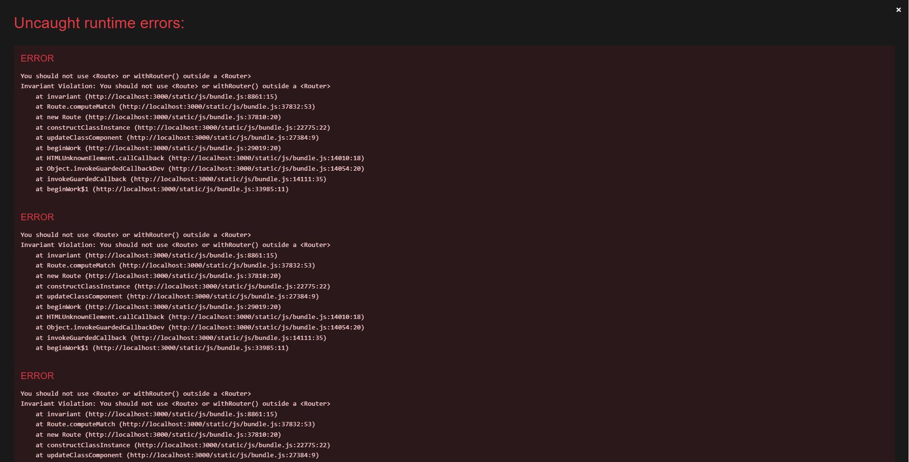
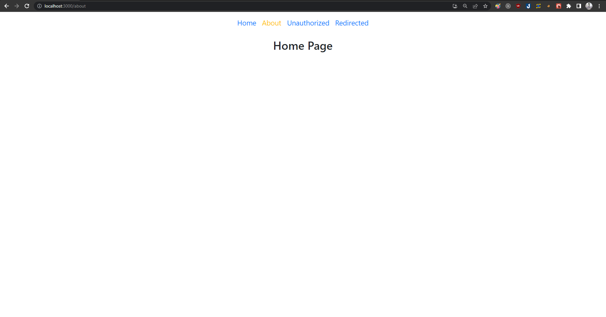

# Single Page Application (SPA)

Hiện nay khi lướt web, ta sẽ thường bắt gắp 2 dạng Web Application:

- **Single Page Application (SPA)**: Facebook, Youtube, Netflix, ...
- **Multi Page Application (MPA)**: Các trang báo ở Việt Nam như Dantri, Vnexpress, ...

Vậy điểm khác biệt cơ bản giữa chúng là gì?

**Với SPA**:

- Thông thường, chỉ 1 HTML Page và Content của trang web được trình duyệt tải về khi người dùng truy cập trang web
- Việc định tuyến (Routing) khi người dùng truy cập URL nào đó được thực hiện bởi JavaScript
- Cho cảm giác web giống như một ứng dụng di động, mượt mà hơn khi sử dụng
- Giảm thiểu gánh nặng xử lý cho Server
- Phân tách rõ ràng FrontEnd (Client) và BackEnd (Server)
- Không tốt cho SEO

**Với MPA**:

- Mỗi HTML Page, Content của trang web sẽ gắn với một URL, khi người dùng truy cập trình duyệt sẽ tải về các file tương ứng với URL do server cung cấp
- Việc định tuyến được thực hiện bởi Server
- Tốt cho SEO

VD, ta có 2 trang là /user và /product

- **Với SPA**: Trình duyệt chỉ **tải 1 lần 1 file HTML** và content của toàn bộ trang web, việc hiển thị UI tương ứng với URL sẽ do JavaScript đảm nhiệm, nếu URL là /user JavaScript sẽ chỉ render phần UI của /user
- **Với MPA**: Trình duyệt sẽ tải file HTML và content do server trả ra tương ứng với URL, có nghĩa là trình duyệt sẽ tải file HTML và content tương ứng khi truy cập /user và **tiếp tục tải** file HTML và content tương ứng khi truy cập /product

> Tips: Khi chuyển qua lại giữa các tab, navigation, ... của một trang web và thấy URL trình duyệt thay đổi nhưng trang web không reload, đó có thể là dấu hiệu của SPA

# Routing trong ReactJS

- Định tuyến (Routing) ở đây có thể hiểu cơ bản là việc giữ cho giao diện đồng bộ với URL của trình duyệt
- React-Router là một thư viện định tuyến (routing) tiêu chuẩn trong React. Nó giữ cho giao diện của ứng dụng đồng bộ với URL trên trình duyệt

# Cài đặt

```
yarn add react-router-dom@4.2.2
```

# Các component cơ bản

- **Router**: Component low-level bao bọc tất cả các component khác của routing, ngoài ra có thể sử dụng các component high-level như:
  - **Browser Router**: **Thông dụng nhất**, sử dụng HTML5 history API để đồng bộ UI và URL
  - **Hash Router**: Loại routing có dấu # ở đầu, công dụng dễ thấy nhất đó là giúp việc deploy trên những trang có nguồn tài nguyên được chia sẻ giữa nhiều người dùng như Github Pages đơn giản hơn
  - **Static Router**: Thường sử dụng cho Server Side Rendering
  - **MemoryRouter**: Thường sử dụng khi Testing, thanh địa chỉ sẽ không được cập nhận URL mà giữ trong memory (Hữu ích khi sử dụng React Native)
- **Route**: Render component khi path URL ứng với path của Route
- **Switch**: Bao ngoài Route, chỉ render Route đầu tiên match với path URL
- **Redirect**: Điều hướng từ một path này qua path khác, thường đi kèm với điều kiện cụ thể (VD: người dùng chưa login thì khi truy cập web sẽ redirect qua path /unauthorized)
- **Link**: Thẻ chuyển hướng tới path tương ứng
- **NavLink**: Tương tự **Link** nhưng có thêm activeClassName (Hữu ích trong việc CSS tab nào đang active)

# Ví dụ

## Các component của react-router đều phải nằm bên trong Router hoặc các component high-level

```js
import React from "react";
import { BrowserRouter, Route } from "react-router-dom";
import "./App.css";

function App() {
  return (
    <div className="App">
      <BrowserRouter></BrowserRouter>
      // Sử dụng Route ngoài BrowserRouter
      <Route path="/test" component={<div>test</div>} />
    </div>
  );
}

export default App;
```

VD trên sẽ gây ra lỗi sau



## VD cơ bản về React Router

Để demo, ta sẽ có VD bao gồm

- Một header để điều hướng trang web
- Tab đang active sẽ có màu vàng, tab không active sẽ có màu xanh
- Click tab sẽ render ra UI tương ứng, ngoại trừ tab Unauthorized, khi click tab này sẽ tự chuyển hướng đến Redirected Page

```js
import React from "react";
import { BrowserRouter, NavLink, Route, Switch } from "react-router-dom";
import HomePage from "./components/HomePage";
import AboutPage from "./components/AboutPage";
import UnauthorizedPage from "./components/UnauthorizedPage";
import RedirectedPage from "./components/RedirectedPage";
import "./App.css";

function App() {
  return (
    <BrowserRouter>
      <div className="App">
        // Header
        <ul className="header">
          <li className="header-item">
            <NavLink exact to="/" activeClassName="active-header-item">
              Home
            </NavLink>
          </li>
          <li className="header-item">
            <NavLink exact to="/about" activeClassName="active-header-item">
              About
            </NavLink>
          </li>
          <li className="header-item">
            <NavLink
              exact
              to="/unauthorized"
              activeClassName="active-header-item"
            >
              Unauthorized
            </NavLink>
          </li>
          <li className="header-item">
            <NavLink
              exact
              to="/redirected"
              activeClassName="active-header-item"
            >
              Redirected
            </NavLink>
          </li>
        </ul>
        <Switch>
          // Định nghĩa routing của web
          <Route exact path="/">
            <HomePage />
          </Route>
          <Route exact path="/about">
            <AboutPage />
          </Route>
          <Route exact path="/unauthorized">
            <UnauthorizedPage />
          </Route>
          <Route exact path="/redirected">
            <RedirectedPage />
          </Route>
        </Switch>
      </div>
    </BrowserRouter>
  );
}

export default App;
```

Trong VD trên xuất hiện từ khóa 'exact', từ khóa này cũng sẽ đóng vai trò trong việc định tuyến như sau

| path (Route) | path (URL) | exact | match? |
| :----------: | :--------: | :---: | :----: |
|      /       |   /about   | false |  yes   |
|      /       |   /about   | true  |   no   |

Giả sử ta bỏ từ khóa này ở 2 path / và /about

```js
...
<Route path="/">
  <HomePage />
</Route>
<Route path="/about">
  <AboutPage />
</Route>
...
```

Nhờ bảng trên, khi không có từ khóa 'exact', khi qua path /about, nó sẽ match ngay với path / ở Route, khiến cho HomePage được render thay vì HomePage


