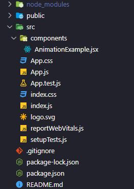
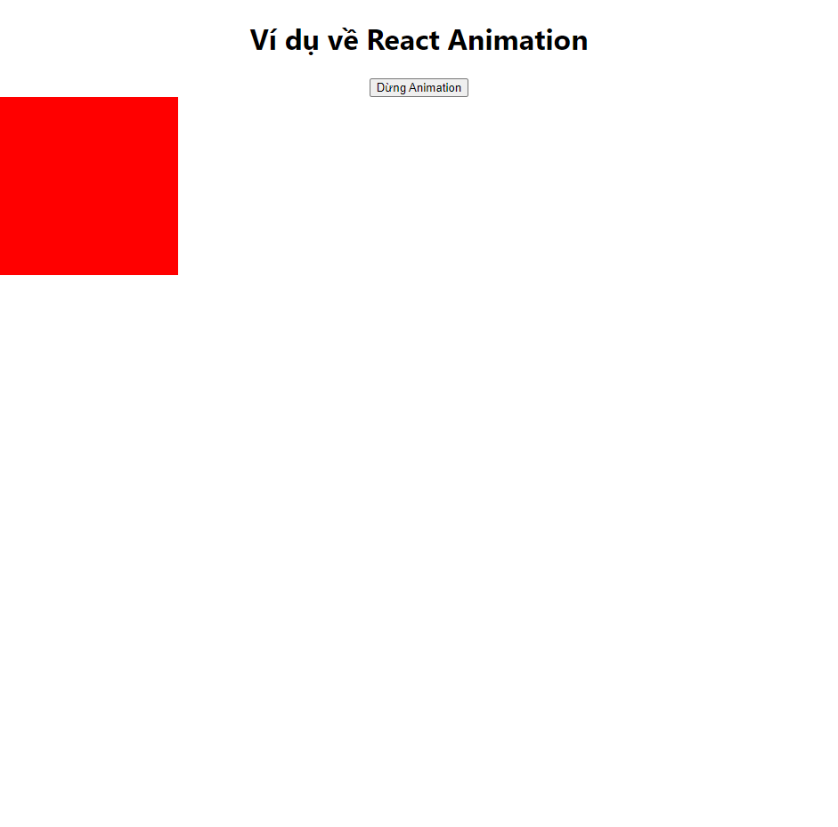

# React Animation

- Chúng ta có thể tạo các animation để tạo các hiệu ứng chuyển động và tương tác vào ứng dụng React, qua đó làm tăng trải nghiệm người dùng.
- Chúng ta có thể tạo các animation bằng nhiều cách khác nhau, ví dụ như CSS animations, CSS transition và các thư viện hỗ trợ việc tạo animation bằng React. Một trong số các thư viện đó là React Spring.

# [React Spring](https://www.react-spring.dev/docs)

- React Spring là một thư viện animation mạnh mẽ dành cho React, giúp bạn tạo ra các hiệu ứng chuyển động mượt mà và tương tác một cách dễ dàng. Nó cung cấp một API đơn giản và trực quan, giúp cho việc tạo animation trở nên dễ dàng cho developers
- React Spring sử dụng `animated` component, bản chất là một [higher-order component (HOC)](https://legacy.reactjs.org/docs/higher-order-components.html), và các hook (ví dụ useSpring, useSprings, useTransition,...)

### Cài đặt

```bash
// npm
npm install react-spring
// yarn
yarn add react-spring
```

### Ví dụ:

Cấu trúc thư mục:



Đầu tiên, chúng ta tạo một file AnimationAxample.jsx

```javascript
import React, { useState } from "react";
import { useSpring, animated } from "react-spring";

const AnimationExample = () => {
  const [isAnimating, setIsAnimating] = useState(false);

  // hook `useSpring` để tạo ra một SpringValues để truyền vào `animated` component.
  // Khi component mounted, các thuộc tính trong SpringValues sẽ được áp dụng
  const boxAnimation = useSpring({
    opacity: isAnimating ? 1 : 0,
    transform: isAnimating ? "translateY(0)" : "translateY(-100%)",
  });

  // Ở đây chúng ta dùng state `isAnimating` để diều khiên trạng thái của animation
  // và 1 button để toggle giá trị của `isAnimating`

  return (
    <div>
      <button onClick={() => setIsAnimating(!isAnimating)}>
        {isAnimating ? "Dừng Animation" : "Bắt đầu Animation"}
      </button>
      <animated.div
        style={{
          ...boxAnimation, // truyền SpringValues cho `animate` component
          width: "200px",
          height: "200px",
          backgroundColor: "red",
        }}
      />
    </div>
  );
};

export default AnimationExample;
```

Sau đó, import component AnimationExample vào App.js

```javascript
import "./App.css";
import AnimationExample from "./components/AnimationExample";
import CustomCard from "./components/Card/index.jsx";

function App() {
  return (
    <div className="App">
      <h1>Ví dụ về React Animation</h1>
      <AnimationExample />
    </div>
  );
}

export default App;
```

Sau khi đã import, chúng ta chạy `npm start` hoặc `yarn start` để chạy project.



Trong ví dụ trên, chúng ta có tạo 1 hình vuông và 1 nút để chuyển đổi trạng thái hiệu ứng của hình vuông đó
