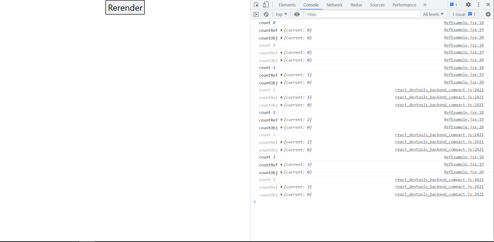
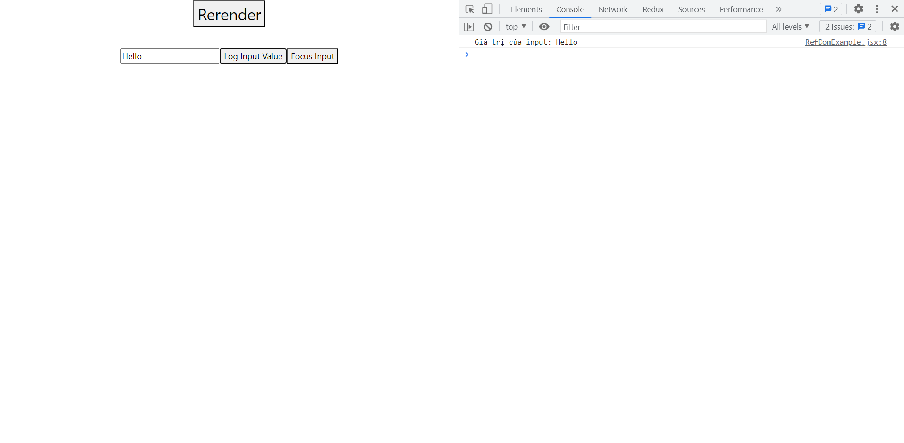

# Một số hook cơ bản

## useState

Dùng để khai báo state của component (Chuyển qua nhánh state-and-prop để biết thêm thông tin)

## useRef

Được sử dụng để

- Lưu trữ tham chiếu giữa các lần re-render của component
- Truy xuất đến thành phần DOM

Việc thay đổi giá trị của useRef không gây ra sự re-render của component như useState, vì vậy, các biến liên quan đến hiển thị UI thì ta nên sử dụng useState, còn lại có thể sử dụng useRef

### Syntax

```js
import {useRef} from "React"
...
const ref = useRef([Giá trị khởi tạo]);
```

### VD Lưu trữ tham chiếu giữa các lần re-render của component:

```js
// RefExample.jsx

import React, { useRef, useState } from "react";
import "../assets/css/refExample.css";

const RefExample = () => {
  const countRef = useRef(0);
  const countObj = {
    current: 0,
  };

  const [count, setCount] = useState(0);

  const increaseCount = () => {
    countRef.current++;
    countObj.current++;
    setCount(count + 1);
  };

  console.log("count", count);
  console.log("countRef", countRef);
  console.log("countObj", countObj);

  return (
    <button className="increaseBtn" onClick={increaseCount}>
      Rerender
    </button>
  );
};

export default RefExample;
```

Ở đây, ta sẽ sử dụng 1 state count và với mỗi lần bấm nút, state này sẽ bị thay đổi dẫn tới việc component RefExample sẽ được re-render

Quan sát giá trị của countRef và countObj ta thấy:

- Với countRef, giá trị current sẽ bị thay đổi sau mỗi lần component re-render do giá trị trước đó vẫn được lưu lại
- Với countObj, giá trị current sẽ giữ nguyên do mỗi lần component re-render thì giá trị của các object thường như này sẽ được khởi tạo lại hoàn toàn



### VD Truy xuất đến thành phần DOM:

```js
// RefDomExample.jsx

import React, { useRef } from "react";

const RefDomExample = () => {
  // Thường khi dùng ref truy xuất DOM giá trị khởi tạo sẽ là null
  const inputRef = useRef(null);

  const getInputValue = () => {
    console.log("Giá trị của input:", inputRef.current.value);
  };

  const focusInput = () => {
    inputRef.current.focus();
  };

  return (
    <div>
      <input type="text" ref={inputRef} />
      <button onClick={getInputValue}>Log Input Value</button>
      <button onClick={focusInput}>Focus Input</button>
    </div>
  );
};

export default RefDomExample;
```

Trong trường hợp này, ref chính là một element trên DOM, hay cụ thể hơn là input, ta hoàn toàn có thể thao tác với element này như lấy giá trị của input hay click button để focus input này



## useEffect

Được sử dụng để xử lý các side effects như

- Thao tác API
- Thao tác với DOM
- Thêm, xóa event listeners ('click', 'scroll', ...)
- setTimeout, setInterval

### Syntax

```js
import {useEffect} from 'React'
...
useEffect(callback, dependency array nếu có);
```

### VD về các TH của dependency array

- Trong TH dependency array không xuất hiện, useEffect sẽ chạy với mỗi lần component re-render
- Trong TH dependency array rỗng, useEffect sẽ chạy đúng một lần khi component render lần đầu tiên
- Trong TH dependency array có giá trị, useEffect sẽ chạy khi component render và một trong các giá trị truyền vào có sự thay đổi

```js
// EffectExample.jsx

import React, { useEffect, useState } from "react";

const EffectExample = () => {
  const [countA, setCountA] = useState(0);
  const [countB, setCountB] = useState(0);

  useEffect(() => {
    console.log("Không có dependency array");
  });

  useEffect(() => {
    console.log("Dependency array rỗng");
  }, []);

  useEffect(() => {
    console.log("Dependency array phụ thuộc vào countA");
  }, [countA]);

  useEffect(() => {
    console.log("Dependency array phụ thuộc vào countA");
  }, [countA, countB]);

  const handleIncreaseCountA = () => {
    setCountA(countA + 1);
  };

  const handleIncreaseCountB = () => {
    setCountB(countB + 1);
  };

  return (
    <div className="effect-example">
      <div className="count-text-wrapper">
        <h1>Count A: {countA}</h1>
        <h1>Count B: {countB}</h1>
      </div>
      <div>
        <button onClick={handleIncreaseCountA}>Increase Count A</button>
        <button onClick={handleIncreaseCountB}>Increase Count B</button>
      </div>
    </div>
  );
};

export default EffectExample;
```

### VD về clean up function

Khi truyền callback vào useEffect, callback có thể return một clean up function. Clean up function mang vai trò 'dọn dẹp' những gì đã thực thi trong useEffect nếu cần thiết

Ở VD dưới đây, ta sẽ có bộ đếm (component Counter) tăng theo từng giây sử dụng setInterval và một button ẩn hiện bộ đếm này. Trong một số TH ta cần bộ đếm bị ẩn đi (hay component Counter bị loại bỏ khỏi view), ta sẽ muốn bộ đếm này dừng lại để tránh một số hành vi không mong muốn. Việc này sẽ được xử lý ở clean up function bằng cách clearInterval

```js
// EffectIntervalExample.jsx

import React, { useState } from "react";
import Counter from "./Counter";

const EffectIntervalExample = () => {
  const [showCounter, setShowCounter] = useState(true);

  const toggleCounter = () => {
    setShowCounter((prevShowCounter) => !prevShowCounter);
  };

  return (
    <div>
      {showCounter && <Counter />}
      <button onClick={toggleCounter}>Toggle Counter</button>
    </div>
  );
};

export default EffectIntervalExample;
```

```js
// Counter.jsx

import React, { useEffect, useState } from "react";

const Counter = () => {
  const [count, setCount] = useState(0);

  useEffect(() => {
    const interval = setInterval(() => {
      setCount((prevCount) => prevCount + 1);
      console.log("Increase count");
    }, 1000);

    return () => {
      clearInterval(interval);
    };
  }, []);

  return (
    <div>
      <h1>Count: {count}</h1>
    </div>
  );
};

export default Counter;
```

Trong trường hợp không có clean up function hoặc clean up function không xử lý việc clearInterval, kể cả khi ẩn bộ đếm, ta vẫn sẽ thấy trong console liên tục in ra 'Increase count' => Đây là điều ta không mong muốn xảy ra
