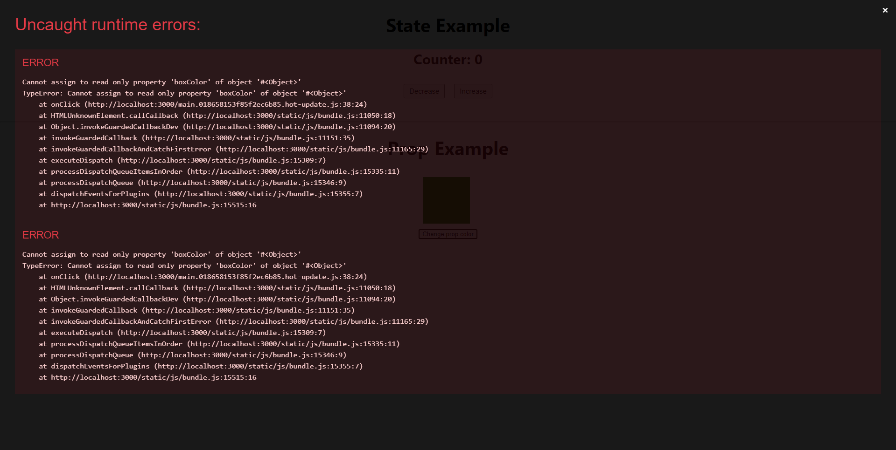

# State

- Được sử dụng để quản lý dữ liệu của riêng component chứa nó
- Thay đổi được giá trị thông qua hook useState (Functional Component), khi state thay đổi giá trị, Component chứa state sẽ được re-render
- Syntax:

```js
import { useState } from "react";
...
const [state, setState] = useState([Giá trị khởi tạo])
```

Với VD bộ đếm (counter) trong StateExample.jsx, ta sẽ có 1 state mang tên 'counter', phương thức cập nhật lại giá trị của state này là 'setCounter' và state này có giá trị ban đầu = 0

```js
const [counter, setCounter] = useState(0);
```

Khi thực hiện bấm nút Increase, function handleIncrease sẽ được gọi ở onClick của button, setCounter sẽ được thực hiện và thay đổi tăng state counter, dẫn tới việc Component StateExample được render lại và số tương ứng sẽ xuất hiện

Trường hợp tương tự xảy ra với nút Decrease

# Prop

- Được sử dụng để truyền dữ liệu giữa các Component của React theo hướng từ Component cha sang Component con dưới dạng một object
- Không thể thay đổi được, prop là dạng dữ liệu 'chỉ đọc' tức là props không thể thay đổi ở Component con, nếu cần có sự thay đổi thì phải thay đổi ở Component cha sau đó truyền lại xuống

Với VD trong Component cha PropExample.jsx, ta truyền dữ liệu là màu của box xuống Component con là Box.jsx

```js
<Box boxColor="green" />
```

Component Box sẽ nhận được prop và dữ liệu sẽ được sử dụng để set màu như trong style ở bên dưới.

```js
const Box = (props) => {
  // props = {boxColor: green}
  return (
    <div>
      <div className="box-wrapper" style={{ backgroundColor: props.boxColor }}></div>
      ...
    </div>
  );
};
```

Ta hoàn toàn có thể thử các giá trị màu khác để nhận được các box với màu tương ứng

```js
...
<Box boxColor="black" />
<Box boxColor="blue" />
...
```

Để demo việc **prop không thể thay đổi được**, ta sẽ thử thay đổi màu của box bằng cách đặt thêm một button 'Change prop color', khi click ta sẽ thục hiện set lại giá trị boxColor của prop

```js
const Box = (props) => {
  return (
    <div>
      <div className="box-wrapper" style={{ backgroundColor: props.boxColor }}></div>
      // button được thêm ở đây
      <button
        onClick={() => {
          props.boxColor = "yellow";
        }}
      >
        Change prop color
      </button>
    </div>
  );
};
```

Một lỗi sẽ được hiển thị thông báo ta không thể gán giá trị 'chỉ đọc' ở đây là boxColor từ prop



Để thay đổi được màu của box, ta sẽ phải thực hiện ở Component cha PropExample.jsx:

- Ta đặt thêm 2 button ở Component cha lần lượt là 'Change to red' và 'Change to yellow' và dùng 1 state để quản lý màu (Cần state thay vì biến thường để trigger re-render Component và thấy được sự thay đổi)
- Ban đầu, với giá trị mặc định của state boxColor là green, Box sẽ được render và hiển thị với màu xanh tương ứng
- Khi bấm 1 trong 2 button trên, state boxColor sẽ được thay đổi, đồng nghĩa với việc Component cha là PropExample chứa state sẽ được re-render, Box lúc này cũng sẽ được render lại với giá trị boxColor mới tương ứng với nút vừa bấm

```js
const PropExample = () => {
  const [boxColor, setBoxColor] = useState("green");

  const handleChangeToRed = () => {
    setBoxColor("red");
  };

  const handleChangeToYellow = () => {
    setBoxColor("yellow");
  };

  return (
    <div>
      <h1>Prop Example</h1>
      <div className="box-container">
        <Box boxColor={boxColor} />
      </div>
      // button được thêm ở đây
      <button className="state-change-btn" onClick={handleChangeToRed}>
        Change to red
      </button>
      <button className="state-change-btn" onClick={handleChangeToYellow}>
        Change to yellow
      </button>
    </div>
  );
};

export default PropExample;
```
